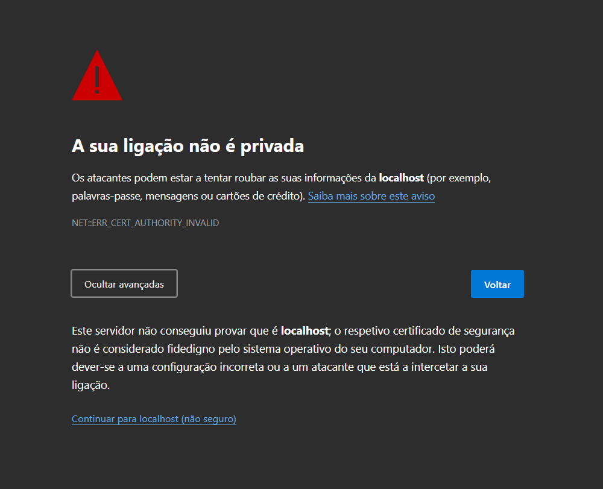

# Cryptography Project

Este projeto demonstra a implementação de um website seguro com HTTPS utilizando Flask e uma infraestrutura de PKI personalizada.

## Como Executar

1. Certifica-te de que tens **Docker** instalado.
2. No terminal, executa:
   ```bash
   make
   ```
3. Abre o browser e navega para:
   - [https://localhost](https://localhost)

Inicialmente irá aparecer este aviso, visto que o certificado usado para a ligação HTTPS não é considerado fidedigno.
Basta clicar em  Avançadas -> Continuar para localhost


## Estrutura do Projeto

- **certificates/**: Contém os certificados e chaves para a PKI.
  - `ca.crt`, `ca.key`: Certificado e chave da Autoridade Certificadora.
  - `server.crt`, `server.key`: Certificado e chave do servidor.
  - `clients/`: Chaves públicas/privadas dos utilizadores.
  - `Message_Userkeys/`: Chaves usadas para mensagens seguras.
- **nginx/**: Configuração do proxy reverso.
- **postgresql/**: Configuração do banco de dados.
- **website/**: Código principal da aplicação Flask.

## Funcionalidades

1. **HTTPS Seguro**: Comunicação protegida com certificados SSL/TLS.
2. **Login Seguro**: Autenticação utilizando chaves da PKI.
3. **Troca de Mensagens Seguras**: Encriptação e assinatura digital de mensagens.
